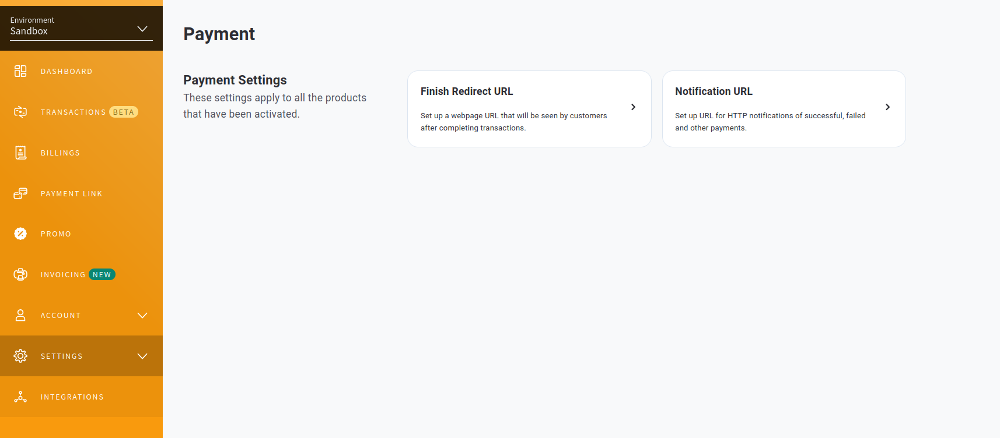

### Go Midtrans Example
This is an example of how to use the Midtrans Snap API in Go with the official [midtrans-go](https://github.com/Midtrans/midtrans-go) client SDK. This example uses `sqlite` as the database for the sake of simplicity and minimal setup. This simple server will cover:
- Making simple transactions and saving the transaction details in a database
- Handling After Payment Callbacks and updating the transaction status in the database


### Prerequisites
- Midtrans Account with Server Key.
- Proxy tools like [ngrok](https://ngrok.com/) or [zrok](https://zrok.io) to expose your local server to the internet. This is required only if you want to test the Midtrans after payment callback.

### How to Run
1. Clone the repository
2. Rename the `.env.example` file to `.env` and fill in the required details
3. If you have air installed, you can run `air` to run the server. If not, you can run `go run main.go`

When running the server, a SQLite database named `example.db` will be created in the /db folder if it doesn't exist. It also performs a simple migration and seeding. If you want to reset the database, you can delete the `example.db` file and re-run the server again.


### Endpoints
- `GET  /`                  - Hello World
- `GET  /products`          - Get all products
- `GET  /transaction`       - Get all transactions
- `GET  /transaction/:id`   - Get transaction details
- `POST /transaction`       - Create a transaction.
    ```json
    # See the terminal log after running the server to use the seeded user id
    {
      "userId":"58f6a1d6-e883-4371-9b5d-c97edc3b1cf2", 
      "details": [
        {
          "productId": 1,
          "quantity": 1
        },
        {
          "productId": 2,
          "quantity": 1
        }
      ]
    }
    ```
- `POST /payments`          - Process payment
    ```json
    Request Body:
    # Use the transaction id from the response of the create transaction endpoint
    {
        "transactionId": "97dbe05a-f9cf-475a-80a6-f0263675fcc5",
    }

    Response Body:
    {
        "token": payment_token,
        "redirectUrl": midtrans_payment_redirect_url
    }
    ```
- `POST /payments/callback` - After Payment callback/notifier URL, this will hit by Midtrans after payment is done.


### Setup Callback Endpoint
This is required only if you want to test the Midtrans after payment callback.
1. Expose your local server to the internet using [ngrok](https://ngrok.com/) or [zrok](https://zrok.io) or any other proxy tool.
2. Go to [Payment Setting](https://dashboard.sandbox.midtrans.com/settings/payment), Select Notification URL.

3. Fill in the `Payment Notification URL` with the exposed URL. (e.g. `https://your-exposed-url/payments/callback`)

4. Hit the `Test notification URL` button to test the connection. If successful, save the changes and you are good to go.


### Flow
1. Create a transaction by hitting the `/transaction` endpoint. The transaction will be saved in the database.
2. Process the payment by hitting the `/payments` endpoint. Use "redirectUrl" from the response to redirect the user to the Midtrans payment page.
3. Do the payment. Use midtrans [simulator](https://simulator.sandbox.midtrans.com) to simulate the payment. 
4. After payment, Midtrans will hit the `/payments/callback` endpoint. If the payment is successful, the transaction status will mark as `completed` in the database. (Requires Setup Callback Endpoint)
